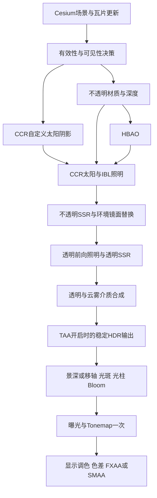

# 阶段一基础渲染管线完整开发计划

> 执行方式：由当前会话亲自执行，使用 executing-plans 按批次推进；不下发执行端会话、不启用子代理。本文是开发计划，不是完成报告。勾选框仅在对应代码、运行证据和验收条件都满足后更新。

> 通用范围纠偏：CCR面向通用Cesium场景，B00默认无外部资产的合成验证；校园仅是可选集成用例。详见 [RENDERER_SCOPE.md](RENDERER_SCOPE.md)。

**Goal：** 在现有 CCR 独立项目内，完成阶段一的主照明接管、透明兼容、性能基础与基础环境/后期；产出可复现构建的 CCR SDK。
**Architecture：** 保留 Cesium 1.143 的场景管理、3D Tiles 调度、几何处理、拾取和 HDR 底座；由 CCR 组织受支持不透明材质的 G-buffer/PBR 照明、自定义太阳阴影、透明前向与环境后期。未适配材质走明确标记的兼容路径，不悄悄重光照、不把后处理重放当作已完成架构替代。
**Tech Stack：** JavaScript ES modules、Cesium 1.143.0、WebGL2/GLSL ES 3.00、Node test、Chrome/WebGL 数值、多位置合成与可选真实场景验证、Webpack UMD。

编制日期：2026-09-15。当前开发仓库 HEAD 为 b2b182e，后续功能大量存在于未提交工作区；执行前必须重新记录工作区快照。当前任务仅制定计划，没有执行下列功能开发。

## 1. 依据、目录与范围

- 目标：[阶段1：基础渲染管线](<./阶段1：基础渲染管线.md>)。
- 审计：[阶段一开发进度核查_0915](<./阶段一开发进度核查_0915.md>)。
- 逐文件复用清单：[STAGE1_REUSE_MAP.md](./STAGE1_REUSE_MAP.md)；后续任务中的 R01–R15 对应其条目。
- CCR 根目录：`G:/_JavaScript/_IAsCesiumLib/cesium customRenderer`。
- Tianjing 根目录：`G:/_JavaScript/新版cesium示例/tianjingmap-3d`，只读参考。
- 核心基准：无外部资产的合成夹具及跨地理位置回归；[examples/campus.html](<../examples/campus.html>)仅作可选真实资产集成，不定义管线范围。

**延续用户已确定的范围：**

1. 植被/实例化网格不在本计划内；多光源/5000灯列为 B13 暂缓项，前十二批不恢复它。
2. 云层在所有相机高度维持 12–50 km 平滑渐隐/截断，不恢复高空扩大范围，也不新增完整天气系统、云投地阴影或阶段二天气模拟。
3. FXAA/SMAA/MSAA保持已有成果；TAA单列稳定性验收，不能在其他效果中顺手改动相机抖动。
4. 不恢复白模强镜面改色；保留中性PBR、SSR环境回退和用户校园资产、底图配置。
5. 不要求旧RuoYi登录后的完整业务验收；独立campus的交互、拾取和画质仍需验证。
6. 不整体替换旧引擎Build、不重建另一套SDK入口；公共浏览器入口保持CCR。
7. 不擅自提交、推送或发布本轮代码；每批形成可审阅差异和证据，阶段提交按实际授权处理。

**两种交付口径：**

- **阶段一当前范围候选产物**：B00–B12全部达到其验收门槛，文档明确多光源暂停、支持矩阵和兼容路径。可供业务集成，不能称原始阶段一全部完成。
- **阶段一原始目标完整完成**：上述门槛 + B13恢复并通过5000+实际光照验收。复杂任意自定义材质、无限透明层精确排序、离屏动态建筑反射等不是本阶段默认承诺；保留兼容模式，不把它们伪装成已支持延迟照明。

## 2. 架构选择与必须先解决的问题

| 路线 | 实质 | 取舍 |
| --- | --- | --- |
| 继续在最终颜色上叠加效果 | 现有CCR增强路径 | 保留作A/B和失败恢复；无法独立完成材质/照明解耦 |
| **渐进接管不透明照明＋独立透明前向** | 标准PBR由CCR算光，其他类型按明确矩阵兼容；原生负责资源与场景调度 | **采用**；能逐批验证、复用最多，但需新增严格的1.143执行适配 |
| 整份迁移Tianjing旧Build或全面重写Cesium | 短期复制模块多，长期引擎耦合与回归范围大 | 不采用；旧Build私有接口与1.143不匹配，也未补齐对象遮挡闭环 |

当前 `HdrCoordinator143.registerHdrEffect` 包装 `postProcessStages.execute`，此时OIT已合成。单纯新增priority更小的HDR效果，仍无法在透明前取得完整不透明输出。必须先验证B01的执行桥。

当前材质附件全开时已达8槽；WebGL2设备不能一律假定8槽可用。延迟模式用精简数据契约，并把透明覆盖独立处理；不能再直接向现有布局追加位置、速度等附件。

### 2.1 目标帧顺序



这是**目标顺序**，当前代码不是此顺序。MSAA作用于适用几何目标，不是图中的末端滤镜。兼容前向对象必须参与正确深度测试；背景天空和影像不能因缺材质flags被清空。光柱的遮挡数据在介质阶段产生，光斑的艺术叠加在镜头阶段完成。

### 2.2 核心数据契约

| 数据 | 计划格式/来源 | 关键约束 |
| --- | --- | --- |
| normalRoughMetal | B02 compact-v1：RGBA32F，原生XYZ法线＋roughness | 旧增强布局不变；不能按旧八面体格式解释新数据 |
| albedoOcclusion | RGBA16F | 线性基础色与材质AO，不能用已照明主颜色代替 |
| emissiveFlags | B02 compact-v1：RGBA32F | HDR自发光；低十位材质flags，高位环境group ID |
| eyeDepth | B02 compact-v1：RGBA32F，深度/eye X/eye Y/metalness | R通道仍为正米制视深度，0背景，负值未知；禁止作为窗口深度 |
| depth/stencil | 每视锥几何目标 | 保留log-depth、MASK、裁剪、模板和拾取原语义 |
| transparency coverage | 独立R8 pass | 保守覆盖不等于alpha或透射率 |
| opaque HDR / indirect specular | 照明resolve输出/可选独立目标 | SSR替换同一次照明的环境镜面分量；不再依赖重放原生照明获取它 |
| frame context | 现有Camera UBO扩展和CPU元信息 | 帧/视图/资源generation、相机、太阳和曝光单位一致；不改旧UBO字段偏移 |

四个颜色附件是延迟模式的最低完整布局。它是新消费者契约，不能悄悄改变现有公开 `getTextures()` 的4/6/7/8附件语义；旧增强模式保持可运行。标准PBR先复用同一材质求值代码，禁止维护两份不同的纹理/颜色解码算法。

照明拆分的测试契约：

```text
diffuseColor = baseColor * (1 - metallic)
F0 = mix(0.04, baseColor, metallic)
Lo = directSunWithShadow + indirectDiffuseWithAO
   + indirectSpecular + emissive
finalSpecular = mix(environmentSpecular, ssrSpecular, confidence)
```

具体BRDF必须与本地1.143 `computePbrLighting/czm_pbrLighting` 的roughness、Fresnel、IBL和色彩空间逐项对齐；上式用于定义组成，不能替代完整BRDF实现。HBAO不再无差别乘到directSun/emissive上。

## 3. 批次、依赖与交付

| 批次 | 内容 | 前置 | 交付判定 |
| --- | --- | --- | --- |
| B00 | 基线、资产/证据与测试入口整理 | 无 | 可复现当前画面，不混入旧宿主依赖 |
| B01 | 帧执行桥与透明前接入验证 | B00 | 能定位/替换不透明颜色，透明与拾取不损坏 |
| B02 | 精简G-buffer与单太阳＋IBL延迟PBR | B01 | 受支持对象停止原生重复照明，由CCR独立出色 |
| B03 | 透明前向、背景/兼容对象与反射合成 | B02 | 不透明/透明完整闭环、无二次照明 |
| B04 | 自定义太阳阴影级联 | B03 | 近远精度与过渡稳定，全球相机自动跟随 |
| B05 | 统一帧数据与跨效果目标复用 | B03 | 实际减少重复上传与同时存活资源 |
| B06 | 遮挡体缓存与对象剔除闭环 | B01、B02、B05 | 安全地减少实际绘制，不影响投影和拾取 |
| B07 | SSR水面/湿地与材质覆盖补齐 | B03、B04 | 玻璃/水/积水/白模代表样例可用 |
| B08 | 地理高度一致的体积雾与云层收口 | B03、B04、B05 | 跨区域无原点跳变，遵守固定云距 |
| B09 | Tonemap与影视后期、光斑/光柱 | B03、B08 | 逐项独立可控，曝光映射一次 |
| B10 | TAA稳定性收口及空间AA组合回归 | B03、B07、B08、B09 | 不用模糊掩盖抖动，能力边界有证据 |
| B11 | 全管线生命周期、能力降级与默认值 | B04–B10 | 异常恢复、多Viewer和资源压力通过 |
| B12 | 通用场景矩阵验收、SDK与发布准备 | B11 | 固定负载画质/性能与源码/UMD一致 |
| B13 | 5000+延迟光源（暂缓） | B02、B03、B05、用户恢复此项 | 实际光照与性能通过后才关闭原始缺口 |

建议严格按表内顺序亲自执行，每批只处理自己的功能和必要依赖。B04/B05技术上可交换；不并行修改同一管线。B01–B03为第一个架构检查点，B04–B08为第二个稳定性检查点，B09–B12为候选交付检查点。B13不阻塞前十二批，但阻止“原文全部完成”的结论。

## 4. 逐批执行步骤与验收

所有“新增”文件均为计划文件，当前不存在；表内代码路径相对CCR根目录。每批先增加能揭示缺口的测试/夹具，确认旧实现确实不满足，再最小实现并运行对应检查。不得把测试变为仅断言源码包含某字符串。

### B00：锁定可复现基线

**复用：** R01、R14、R15。
**修改：** `scripts/check-stage1.cjs`、`scripts/check-campus-aa.cjs`、`docs/API.md`；仅按实际迁移需要修改。
**新增：** `tests/rendering/stage1-baseline.json`、`scripts/check-stage1-acceptance.cjs`、`docs/STAGE1_ACCEPTANCE.md`。

**本批当前口径：** B00/B01专项修复与验证见 [修复交接](B00_B01_FIX_HANDOVER.md) 与 [验收说明](STAGE1_ACCEPTANCE.md)。历史审查问题记录在STAGE1_B00_B01_REVIEW.md。

- [x] 源码按内容SHA256记录，资产独立清单；固定镜头记录可见模型材质/贴图/alpha类型分布。
- [x] 隔离、CCR默认和质量组合分别采集，显式update与只读compare分离，目标/配置不会相互覆盖。
- [x] 默认CCR阴影与SMAA纳入严格基准；五组已独立复比。校园质量组合严格比较失败，撤下该组golden，没有放宽阈值。
- [x] 每镜头检查模型/影像就绪；空图层、HTTP503、曝光回归和黑色空帧有负例；真实影像失败如实保留。
- [x] Node、GPU数值、SDK与空间AA生命周期形成当前证据；headless样本不作正式FPS验收。
- [ ] 旧宿主完整material/albedo/透明/TAA GPU夹具按B02/B03/B10消费者需求继续迁移；本批未运行它们，不沿用历史测试数作通过证据。

B00工具修复可关闭；当前场景总体质量验收仍有明确未通过项目。不得由工具通过推导全部校园场景通过。

### B01：OIT帧执行桥与接点验证

**已落地：** src/pipeline/FrameBridge143.js、单层线性透明夹具、check-frame-bridge.cjs与生命周期单测。它尚未自动接入VisualPipeline，不是主照明resolve。

- [x] 只包装Scene/OIT实例方法；不把模块闭包当作可包装方法。
- [x] 最终OIT合成前绑定真正Framebuffer；MRT、MSAA4、multipass、10视锥、无玻璃与UMD已实测。
- [x] 单透明平面alpha=0/0.5/1的线性结果、独特对象ID和拾取深度均验证。
- [x] 原生调用链/外部wrapper、重装、回调内卸载、安装失败回滚、resize、读回缓存和资源释放有回归。
- [x] 帧外/拾取/不支持阶段明确拒绝写入；上下文丢失退役，宿主恢复后再显式安装。
- [x] 排序透明保留原生增强路径；无伪造opaque阶段，写入返回false。

**能力边界：** 逐视锥事件是观察点。MSAA/多视锥的已验证写入位于最终translucent阶段，即OIT compose之前；它不证明已完成B02逐视锥不透明照明替换。排序透明完整接管仍需B02/B03进一步设计，不靠最终色后处理冒充。

### B02：精简G-buffer与主不透明延迟照明

2026-09-16：受支持的单采样 OIT 标准 PBR 路径及审查 R1–R9 已修复，详见 [B02_COMPLETION.md](B02_COMPLETION.md)。旧失败证据保留，不再作为当前结论。

- [x] 标准 OPAQUE/MASK、法线贴图、双面、实例化、蒙皮与中性 feature 3D Tiles 支持矩阵；其他材质按对象兼容。
- [x] 四颜色附件 compact-v1，独立 R8 透明覆盖，共享原生深度；四槽能力模拟通过。
- [x] 单太阳直接光＋真实模型 SH/预滤镜面 IBL＋自发光；复用原生材质求值和 IBL 实现。
- [x] 自定义太阳阴影作用于直接光，HBAO 在照明前生成并只作用于间接光；保留分项诊断。
- [x] 实际替换主颜色命令：受支持对象原生主颜色 PBR draw 为 0；保留拾取、深度及原生几何变换。
- [x] 独立原生线性 HDR 对照，不变的 ≤0.01 绝对或 ≤2% 相对误差门槛；七材质全部纳入、高光、地理位置、log-depth 开关、多视锥。
- [x] 首次启用、局部 setters、无全局引擎、UMD、资源释放与可重试故障；实验默认关闭。
- [x] 二审三项收尾：部分几何接管失败后同帧原生颜色恢复、故障/运行范围/全兼容回退的 AO 依赖恢复、编译及变体分配失败的程序引用释放；七组故障/回退 GPU 检查通过。
- [x] MSAA/OIT关闭/TAA 等不支持的不透明延迟组合明确回到 enhanced，保留原生颜色。
- [ ] **MSAA 延迟几何接管尚未实现**：现为安全增强回退，不声称完成原计划的单采样 MRT＋多采样主色混合覆盖。
- [x] **SSR 延迟组合**：已由 B03 完成环境镜面替换及玻璃合成验收。
- [ ] **排序透明的不透明延迟接点与 TAA 延迟组合**：继续保留增强兼容，TAA 稳定性在 B10 接续。

精度选择：为避免锐利 GGX 高光误差，法线和 eye-space 坐标保持 FLOAT；compact-v1 实际布局与显存成本见交接。功能通过不等于低显存或正式性能达标。B02 标准不透明核心已形成可提交阶段，上述跨模式缺口仍公开保留，阶段一整体未完成。

### B03：透明前向与兼容合成闭环

2026-09-16：审查 R1–R5 修复；本阶段七项任务在支持/兼容矩阵内完成。详见 [B03_COMPLETION.md](B03_COMPLETION.md)、[B03_VALIDATION.json](B03_VALIDATION.json)。早期 `verification/stage1-B03/` 为已被审查否定的历史记录，当前实测结果位于 `verification/stage1-B03-fixed/`。

- [x] 不透明 HDR 成为透明前向背景；标准 PBR 透明物共享 CCR 太阳、阴影、环境与分项控制，不写入不透明材质目标。
- [x] 保留 OIT MRT/multipass 累积与原生排序透明顺序；五种运行配置验证，明确加权 OIT 的叠层近似。
- [x] SSR 替换同一次 DeferredLighting 输出的环境镜面；增强路径保留 native-replay，新旧数据源互斥，有独立数值和实际呈现贡献验收。
- [x] 天空/Globe 影像/Primitive/unlit/自定义材质及 classification 显式兼容，保留深度/原色；实际影像与分类原生对照通过。
- [x] 玻璃保留透明 SSR/OIT；标准 Water 走 PBR 透明前向，真实 ParticleSystem 走自发光透明前向。云雾视线分段仍属于 B08。
- [x] 两层玻璃、玻璃前后不透明、MASK 孔洞、异步 tile、style 及 OPAQUE↔TRANSLUCENT 切换、拾取/选中轮廓、OIT 两实现及关闭模式通过实际图像检查。复杂模板轮廓走可自动恢复的增强兼容。
- [x] 标准模型 PBR 接管与其他类型的支持/兼容/拒绝矩阵写入交接；不宣称所有 Cesium shader 都已替代。

单层混合门槛固定 0.01；排序叠层同样受门槛约束；OIT 与原生加权混合对照，并单列其精确排序误差。关闭 B03 模块的负例必须失败。B02 的 MSAA 延迟几何和排序模式不透明延迟接点、TAA 延迟组合及 B08 介质分段不随 B03 勾选。

### B04：相机跟随的自定义级联阴影

**复用：** R07；Cesium原生ShadowMap仅作算法/行为对照，不作正常运行回退。
**新增：** `src/shadows/CascadedShadowCoverage.js`、`tests/rendering/shadow-cascades.test.mjs`、`tests/rendering/shadow-cascades-fixture.js`。
**修改：** DirectionalShadowPass、LightFrustum、ShadowTarget、ShadowCache、shaderAdapter143、`scripts/check-camera-shadows.cjs`。

- [ ] 在现有相机跟随覆盖上增加3级联起步，采用线性/对数混合split，初始lambda=0.6；近远界由可见接收范围约束，不能让天空far值直接扩大所有阴影图。
- [ ] 使用固定包围球半径/档位＋光空间texel snapping稳定每级联；相机位移、太阳变化与内容revision分别失效，禁止只按静态时间缓存。
- [ ] 起始总预算为近级2048²、两级1024²；它是测试起点，需实测设备能力和成本，不自动三张2048²。
- [ ] 每级独立caster选择，纳入相机外投影物；包围体高程参与z范围，避免仅用椭球0高程裁剪山地与高楼。
- [ ] 交接区初始为区间末端10%，混合可见性；normal/depth bias以世界米/texel一致计算，防止浮空、重影与远处条纹。
- [ ] 树叶MASK/cutout保持原discard与双面策略。近地树荫与建筑接地分别看，不能统一拉黑环境光来增强阴影。
- [ ] 更新多视锥、Globe、模型/透明接收接口；阴影距离之外平滑衰减。无需用户“移动阴影到新区域”。
- [ ] 对固定时间静止300帧、太阳连续变化、横移/旋转越过split、贴地/10km/高空、山地做图像序列和GPU对比。

**通过：** 固定时刻静止无周期性跳变；级联交界处相邻帧亮度突变在平滑对照区域≤5%作为起始检查线，超过必须定位；树干/建筑根部无新增漂浮间隙；远景精度提升同时记录内存和GPU增量。预算超标调整分辨率/更新策略，不能恢复固定校园范围。

### B05：共享UBO与跨效果FBO资源复用

**复用：** R05、R08、R09。
**新增：** `src/pipeline/RenderTargetPool143.js`、`tests/rendering/render-target-pool.test.mjs`。
**修改：** CameraUniforms、UniformBuffer、HdrCoordinator、HdrBloom、ScreenSpaceAo及FrameBridge。

- [ ] 列出每个pass的读/写、格式、尺寸、samples、首次/最后使用、跨帧历史；先生成资源账本再分配。只管理CCR自有资源，不能接管Cesium借用纹理的销毁。
- [ ] 先接入Bloom中间级和AO临时滤波两个生产者；复用格式/尺寸完全匹配且生存期不重叠的目标。若二者实际无兼容目标，如实保留，不能强制共享来凑节省。
- [ ] 同一帧顺序依赖只需保证不同时读写同附件；TAA历史、SSR历史、材质跨pass活跃数据不得视作临时目标。禁止纹理反馈循环。
- [ ] 定义lease/generation，resize/禁用/失败立即使旧句柄失效；池只复用仍在同一context的资源。Framebuffer附件释放权统一，防止双重destroy。
- [ ] 扩展共享相机/太阳帧数据，沿用160字节旧Camera块或新增独立块，不重排旧偏移。所有CCR消费者逐项迁移，原生Cesium automatic uniforms保持原机制。
- [ ] 同一帧相机/投影被抖动或回放改变时不能只凭frameNumber省略更新；使用实际数据差异与视图revision判断。
- [ ] 统计peakBytes、allocated/reused/live targets、uploadBytes、bufferSubData次数；十轮启停/resize后应回到稳定峰值。

**通过：** 至少一组真实不重叠目标完成复用；GPU输出与禁用池时一致；同值帧无需重复上传，实际值变化当帧更新；停用后自有live leases为0。若并无内存节省，要解释生命周期冲突并调整接入，不能只交一个空池接口。

### B06：实际对象遮挡剔除及缓存

**复用：** R02、R05、R07、R10；没有可直接复制的Tianjing对象反馈实现。
**新增：** `src/visibility/OccluderCache143.js`、`src/visibility/OcclusionCulling143.js`、`tests/rendering/occlusion-culling.test.mjs`、`tests/rendering/occlusion-fixture.js`。
**修改：** FrameBridge、RenderProfiler、VisualPipeline。

- [ ] 首期只针对有可靠包围体的静态不透明模型/瓦片分组，透明、未知自定义变形、相机在包围体内、穿近裁剪面的对象一律可见。
- [ ] 缓存稳定遮挡体的命令和bounds；缓存不以时间停止为有效条件，tile加载/卸载、LOD、show/style、变换、剪裁、场景模式都更新revision。
- [ ] 复用已知深度/命令派生作为遮挡输入，未知Hi-Z值禁止认定遮挡。首个闭环选择WebGL2保守occlusion query＋包围体代理绘制；只在结果已可用时读取。
- [ ] 每帧起始查询预算128个分组，结果跨帧应用。结果未就绪→可见；相机/投影/viewport/遮挡体revision不同→可见；连续两次同状态隐藏结果才进入hidden。相机持续移动时首版可以无剔除收益，不能用旧视图结果冒险。
- [ ] 遮挡体深度本身必须持续更新/绘制，不能因被剔除导致下一帧没有证据；代理深度测试采用保守bounds，关闭颜色/深度写。保持引擎GL状态缓存一致。
- [ ] hidden只跳过主视图颜色与对应材质生产；不跳过太阳阴影caster、拾取、瓦片加载/LOD更新，也不直接修改tileset.show。
- [ ] 对相机突变、遮挡体消失、门洞、细缝、动画对象、tile替换、requestRender模式测试失效。查询pending时不得同步等待阻塞，也不得无限requestRender空转。
- [ ] 对街区遮挡测试统计查询开销、少画命令/三角形、总GPU时间；空旷场景自动不启用/不增加大量查询。通过后再评估是否需要批量Hi-Z/PBO方案，不首期实现两套系统。

**通过：** 遮挡开/关固定图像无对象丢失；相机/内容变化当帧恢复可见；专门遮挡夹具实际主绘制数降低≥20%，总GPU收益超过重复采样噪声；不能仅凭queries>0标为完成。

WebGL2规定query结果不在提交当帧向应用可用，因此跨帧与fail-open是必要契约，见[官方规范](https://registry.khronos.org/webgl/specs/2.0/)。

### B07：SSR材质、水面与积水的最小完整覆盖

**复用：** R03、R04、R06、R11。
**新增：** `src/reflections/PrimitiveReflection143.js`、`tests/rendering/ssr-surfaces-fixture.js`。
**修改：** SSR trace/resolve、材质适配、透明前向；必要时在 `examples/campus.js` 添加独立演示几何，不改用户真实资产。

- [ ] 冻结现有命中置信度/边缘角度渐隐，建立白模绕行图像基准，SSR关/开时基础PBR色不应跳变。
- [ ] 建立独立的标准玻璃、水平水面、局部湿地面代表夹具，之后再选真实场景交叉验证，支持范围明确为标准PBR模型、指定Cesium Primitive材质与Globe water mask路径。
- [ ] 普通Primitive提取实际法线/roughness和材质反射响应；Globe保留影像颜色，对water mask区域建立独立receiver契约，非水地面不擅自金属化。
- [ ] 水面法线使用同一次动画/纹理采样参与照明和反射；透明前向背景与深度来自B03，不照搬Tianjing全局scene._reflectTexture。
- [ ] 离屏/掠射/未知深度时渐隐到已有环境反射。环境反射与SSR共用能量/roughness尺度，不能miss采样最后像素或突然变黑。
- [ ] 明确不实现本阶段未要求的递归反射、复杂折射、动态场景探针或全功能水体系统；不承诺屏外建筑倒影仍存在。
- [ ] 验证卫星影像、feature style、白模/透明OIT、粗糙度梯度、相机旋转/俯仰/近远变化。

**通过：** 三类表面均真实响应材质反射，SSR miss连续回退，无黑块/突兀切换；水面外影像不变灰。水/Globe若无法接入，原SSR完整目标保留未完成，不能仅凭白模样例关闭此项。

### B08：全局地理高度雾、云层及透明介质

**复用：** R07、R09、R12。
**新增：** `src/environment/heightFog143.js`、`tests/rendering/global-fog-fixture.js`。
**修改：** environmentStages、EnvironmentRenderer、HdrEnvironmentPass、cloudShell、TransparentForward。

- [ ] 地理高度以椭球及局部高精度参考计算，禁止ECEF.y当高度；全局含义是任意经纬度一致工作，非一次积分整颗地球。
- [ ] 无噪声基础档复用Tianjing解析指数积分思想及近零Taylor分支；使用CPU数值积分作独立参考。体积档继续使用现有Beer–Lambert积分与太阳阴影。
- [ ] 定义默认有效雾距50km、有限采样预算，近地高度雾作用于地表接收段；高空背地射线正确退出，密度=0严格无影响。
- [ ] 与B01深度契约接通多视锥：按米制距离分段合并透射率T与散射S，满足T=T1*T2、S=S1+T1*S2；不能把不同视锥非线性depth直接比较。
- [ ] 每个透明片元按自身距离读取累计介质，避免只按背后地面深度给玻璃前后都上同一层雾。先通过单透明层解析测试，再验证OIT近似叠层。
- [ ] 云与雾存在交叠时在同一视线分段合成；不支持的复杂情况记录限制，不能重复叠两次完整背景。深度引导上采样防止轮廓云/雾穿透。
- [ ] 云继续使用现有shell与噪声，只接入新的深度/资源链；固定12–50km、区间为空直接退出、不开高空扩距。
- [ ] 全球位置测试包括校园、赤道、接近极区、跨经度、山区、云下/中/上、高空俯视和地平线连续移动。

**通过：** 相同地理高度/相对镜头的密度响应一致，无跨原点跳变；透明前后积分不重复；高空不形成整层灰幕/海量云采样；云空区间无无效raymarch循环。气象模拟和云层时间降噪属于后续阶段，不计本批缺口。

### B09：Tonemap、模糊、色差、光斑与Light Shaft

**复用：** R09、R12、R13。
**新增：** `src/stages/toneMapping143.js`、`src/stages/lensEffects143.js`、`tests/rendering/lens-effects.test.mjs`、`tests/rendering/lens-effects-fixture.js`。
**修改：** VisualPipeline、HdrCoordinator、environmentStages、API、通用示例控制面板。

- [ ] 先暴露ACES/Reinhard/Filmic三个真实曲线选择，复用Cesium自带shader；保留曝光，处理启停恢复，禁止二次gamma或映射。
- [ ] 原文Unreal Filmic不能直接等同Cesium FILMIC：本地FILMIC标注为Uncharted 2曲线。增设明确命名的 `unrealFilmicApprox` 胶片拟合分支，用Epic说明中的film形状/中灰/白点对照校准，并把近似与原版UE颜色管理的差异写清楚；不宣称1:1 UE。
- [ ] 新映射分支需关闭原生重复tonemap并保留后续gamma/alpha契约；如果无法保证只映射一次，该曲线不可启用。
- [ ] 移轴：借鉴Tianjing双向9-tap，核归一化，真实textureSize控制像素半径；输入线性HDR、焦带位置/宽度可调。
- [ ] “泛焦模糊”本计划明确为可关闭的全屏高斯模糊，并补充基于焦距/焦平面的基础景深，避免术语歧义遗漏目标；优先复用Cesium createBlurStage/createDepthOfFieldStage，若其深度/映射阶段不符，适配shader而非复制collection。
- [ ] 色彩通道偏移：在显示阶段按像素单位径向偏移R/B，中心和强度0保持原图，alpha不偏移；与hue/saturation分开。
- [ ] 太阳光斑：生成太阳屏幕位置与可见性遮罩，取深度/云透射率遮挡，背向太阳退出；噪声/图案可参考Tianjing lensFlare，但实例自己持有stage。
- [ ] Light Shaft：独立遮挡mask→半分辨率径向积分→深度感知合成，初始32样本、单太阳；保留已有三维雾散射，两者强度独立，避免双算同一能量。
- [ ] HDR流程中TAA位置更改属于B10的明确迁移任务，此批单独验证TAA关闭路径，并保留原链路。所有新增影视效果默认关闭。
- [ ] 对0/0.18/1/16/64 HDR色阶、强白光、红绿蓝高光、焦带、深度断层、镜头后太阳、建筑遮日、云遮日、resize做数值与图像测试。

**通过：** 所有效果强度0/关闭为identity；常量图模糊不改变亮度；色调映射单调、有确定曝光语义，普通白墙/天空不因Bloom变白幕；光柱/光斑不透墙。每个子项单独完成记录，不能用一个“影视效果完成”掩盖遗漏。

Epic将现代UE Filmic描述为ACES体系；这与本地Cesium FILMIC的Uncharted 2出处不同，见[Epic官方说明](https://dev.epicgames.com/documentation/unreal-engine/color-grading-and-the-filmic-tonemapper-in-unreal-engine)。

### B10：TAA稳定性收口与AA组合

**复用：** R14、R15；不迁移Tianjing resetProjection。
**修改：** `TaaPass143.js`、`taaShaders143.js`、`FrustumJitterBridge143.js`仅限测试定位出的必要部分；SpatialAa保持既有实现。
**新增：** `tests/rendering/taa-stability-fixture.js`；迁移旧宿主taa-quality夹具和测试入口。

- [ ] 先复跑静态边缘、亚像素细线、建筑轮廓、树叶MASK、匀速移动相机、相机cut和动态物体；保存连续帧，不只看单截图。
- [ ] 原有抖动幅度/显示网格/历史裁剪作为基线，验证B01/B02使用的投影与颜色/深度完全对应，真实drawing buffer归一化。
- [ ] 从当前“Bloom后TAA”迁移到目标“稳定HDR后再镜头效果/Bloom”，单独A/B，效果图不能发生额外曝光/alpha变化。
- [ ] 相机历史使用同一坐标空间；多视锥暂不盲目复用单视锥历史，保持显式FXAA回退及原因。
- [ ] 对可刚体追踪对象提供上一帧model变换，优先计算可靠motion/reprojection；不可靠的蒙皮/透明/变形像素使用reactive/reject mask减少历史，不强行平均。此mask用独立目标或现有可复用位，不向满槽MRT追加。
- [ ] 没有有效速度的动态对象不宣称时间稳定增强；保证无新增拖影/漂移，边缘由空间AA托底。完整变形运动向量可留后续，支持矩阵需如实说明。
- [ ] 冻结曝光/太阳/云时间时，测边缘位置序列和灰度剖面；不能通过降低分辨率/增大模糊核让抖动指标变好。
- [ ] 回归FXAA/SMAA三质量档、MSAA实际样本、TAA启停/resize/切模式/相机cut，以及B09的镜头效果组合。

**通过：** 静态收敛后边缘位置峰峰值≤0.25像素、连续亮度无周期跳闪；静态细线对比相对现有SMAA参考损失≤10%作为拟定门槛；相机cut当帧丢弃旧历史，移动遮挡后的旧轮廓最多2帧内消退。指标与多个独立场景的连续序列观感同时判断，超门槛不直接加模糊。

### B11：生命周期、能力降级与默认策略

**复用：** R01、R05、R08、R14。
**新增：** `tests/rendering/stage1-lifecycle-fixture.js`、`scripts/check-stage1-lifecycle.cjs`。
**修改：** 各新模块destroy/ownership、VisualPipeline、presets、诊断与API。

- [ ] 对4/6/8 MRT槽、浮点附件不可用、OIT两模式、MSAA支持交集、非3D和多视锥建立能力矩阵，诊断包含requested/active/reason/generation。
- [ ] 默认仍由CCR管理天空、环境、阴影、HDR和SMAA。延迟模式仅在B01–B03/覆盖矩阵全部通过后进入候选默认；不支持时明确增强模式。
- [ ] HBAO、SSR、Bloom按场景预设显式开启；不能“默认CCR”就自动全开高成本效果。镜头模糊/色差/光斑默认关闭。
- [ ] 20轮启停、嵌套暂停、resize、2个Viewer独立操作、tile异步到达、外部wrapper和参数修改、错误后再次启用。
- [ ] 实际调用WEBGL_lose_context进行丢失/恢复验证：全管线generation重置、纹理/program/UBO/query重新创建，旧异步回调不复活。
- [ ] 确认外部持有参数不被过期快照覆盖；暂停/销毁恢复原生场景状态，不移除宿主后处理。
- [ ] 30分钟交互压力测试，观察自有资源数/估算字节/查询数量不随循环增长；失败路径仍呈现明确可用画面。

**通过：** 无新增pageerror/GL错误，无过期纹理/双重释放，资源数量稳定；恢复后真实渲染输出通过颜色与拾取检查。仅isDestroyed/valid返回值不算画面恢复证据。

### B12：通用场景矩阵验收与SDK候选产物

**复用：** R01、R14、R15。
**修改：** `scripts/check-stage1-acceptance.cjs`、`scripts/build-rendering-sdk.cjs`、API、README、算法来源与许可证记录。
**产物：** `build/<candidateVersion>/CCR.min.js`、manifest、外置引擎接入示例、候选zip、`docs/STAGE1_ACCEPTANCE.md`及本地证据目录。

- [ ] 固定1920×1080实际drawing buffer、目标硬件/浏览器、资产hash、时间/镜头轨迹及曝光。分“隔离基线”“CCR默认”“效果组合”三配置，并登记实际开关值。
- [ ] 预热至少30秒，前台连续记录每条轨迹60秒、重复3轮；若窗口不在前台、配置/资产变化、GPU disjoint，整组不用于性能结论。
- [ ] 性能门槛按目标硬件、模型复杂度与效果组合分别制定。历史校园平均≥30FPS/P95≤33.3ms只属于一个应用用例，不作为所有Cesium场景的统一负载定义。GPU分项、CPU帧时间、资源峰值、draw/三角形一并记录。
- [ ] 若目标硬件/原生场景本身达不到门槛，分别报告原生、旧CCR、新CCR瓶颈，不以静态缓存样本代替动态场景，也不更改负载以“通过”。
- [ ] 逐条画质验收：卫星底图可见、天空不漂白、树荫明显且稳定、无阴影浮空/重影、SSR旋转不骤黑、高空云不扩距、AA不模糊抖动、玻璃水与雾正确排序。
- [ ] 检查拾取/选中、瓦片加载、缩放/旋转、近远切换及多个独立集成用例的场景交互；不恢复RuoYi登录全量验收。
- [ ] 使用同一配置分别加载源码ESM与UMD，检查导出CCR、效果/依赖资源、API和图像一致；manifest记录工作树hash，不能只记录旧HEAD。
- [ ] 用 `npm pack --dry-run` 核对已有ESM包内容，离线最小消费者验证UMD；版本号在候选证据冻结时确定，不在计划中预支发布版本。
- [ ] 阶段提交准备只包含本阶段已审阅代码/文档/必要公开资产；校园私有资源、令牌不进入分发包。保留旧阶段可恢复包，不删除用户工作区。
- [ ] 更新目标进度表：完成/部分/失败/暂缓与证据一一对应，B13仍暂缓时产物名称和说明不得称“原始目标全部完成”。

**通过：** 验收报告对每条目标有证据链接，无未解释画质缺陷；性能门槛达到或明确未达，后者不进入完成状态。提交/推送/发布单独执行，构建完成不代表已发布。

### B13：5000+延迟光源，暂缓但保留完整路线

**状态：暂缓，等待用户恢复多光源开发；本计划不构成恢复该项。**
**复用：** R02、R05、R08；Tianjing只参考灯光类型/衰减公式。
**新增：** `src/lighting/LightManager143.js`、`src/lighting/TiledLightLists143.js`、`tests/rendering/many-lights-fixture.js`。

- [ ] 定义point/spot最小支持集，稳定ID、增删/变换/颜色/半径更新；5000+不等于5000个带阴影灯，首期不包含每灯shadow map。
- [ ] 先做32/128灯与逐灯独立参考一致性，再1000、5000和5120有效灯；禁止只检查CPU数组长度。
- [ ] 重用LightUniforms的数据校验/std140规则；实际大数据用纹理存储并按tile建立灯索引，不把40个128灯UBO全量遍历。
- [ ] 首版CPU投影构建16×16像素tile列表，保守光源范围；GPU使用整数索引纹理和灯参数纹理。WebGL2无compute shader的前提下不写不存在的compute路径。
- [ ] 每tile容量明确，溢出不能静默丢灯：使用分批加法照明或扩大索引存储，同时报告overflow及成本；增加深度分层仅在重叠实测证明需要时推进。
- [ ] 不透明resolve与透明前向消费同一光源定义，透明按自身深度计算，不借用背后opaque深度裁掉可见灯。
- [ ] 两种性能场景必须分开：5000灯城市分布、5120灯高重叠压力。前者验证实际使用目标，后者验证正确性/上限，不能承诺任意最坏分布30FPS。
- [ ] 在B12相同硬件/负载下单独记录GPU、CPU列表更新、上传、各tile灯数及真实可见光照；完成后重跑透明、阴影、AA与SDK验收。

**通过：** 5000以上灯真实参与照明，分布测试达到约定性能门槛；高重叠无丢灯且成本有记录。只有B13也完成，才关闭原文“5000+延迟光源”任务。

## 5. 拟定接口与诊断，实施时保持最小化

优先沿用已有 `setScreenSpaceAO`、`setHdrBloom`、`setAntiAliasing`、环境/SSR setters。下列为**拟新增接口**，不是目前可调用API；执行批次落地后再写入正式API文档。

```js
// B02–B03：实验期显式开启，通过默认切换门槛后preset使用同一选项
pipeline.setLighting({ mode: 'deferred' }) // 'enhanced' 保留旧增强路径
pipeline.getLightingDiagnostics()
// { requested, active, reason, supportedDraws, compatibilityDraws, generation }

// B06：默认实验关闭，有实际收益后才纳入场景推荐组合
pipeline.setOcclusionCulling({ enabled: true })
pipeline.getOcclusionDiagnostics()
// { pendingQueries, visibleGroups, hiddenGroups, skippedDraws, invalidations }

// B09：不把Cesium FILMIC伪装成Unreal
pipeline.setToneMapping({ operator: 'aces' })
// operator: 'aces' | 'reinhard' | 'filmic' | 'unrealFilmicApprox'
pipeline.setLensEffects({
  tiltShift: { enabled: false, focus: 0.5, width: 0.2, radiusPixels: 8 },
  blur: { enabled: false, radiusPixels: 4 },
  depthOfField: { enabled: false, focusDistance: 100, focalLength: 0.05 },
  chromaticAberration: { enabled: false, radiusPixels: 1 },
  lensFlare: { enabled: false, strength: 0.2 },
  lightShaft: { enabled: false, strength: 0.2 }
})
```

参数中的像素为实际渲染目标像素，焦距/距离为米；focus/width为归一化屏幕纵坐标。blur、景深、移轴首期互斥，避免三重模糊；启用一个必须明确反馈另外两项的实际状态。新接口修改自身状态，不重置无关的曝光、底图、阴影或AA。

候选默认策略由presets管理，不为每个实验参数增加永久公共API。性能门槛/算法内部采样数优先留为测试和预设内部常量。

## 6. 验证操作与证据要求

从CCR根目录运行。以下是**现有可用命令**，本计划制定期间未重跑：

```powershell
npm test
npm run build
node scripts/dev-server.cjs --port 8877
```

另一个终端使用已安装Playwright时：

```powershell
$env:CESIUM_PLAYWRIGHT = 'C:/Users/Administrator/.cache/codex-runtimes/codex-primary-runtime/dependencies/node/node_modules/playwright'
$env:CCR_TEST_PORT = '8877'
node scripts/check-stage1.cjs
node scripts/check-campus-aa-lifecycle.cjs
node scripts/check-camera-shadows.cjs
```

- 模块Node测试按新增批次使用 `node --test tests/rendering/<本批文件>.test.mjs`；先验证预期失败，再实现，通过后运行完整npm test。
- 新GPU夹具接入现有check-stage1框架，避免为每个shader复制启动浏览器代码。
- B00新增acceptance脚本后明确提供 `--headless` 诊断与 `--foreground` 正式验证模式；现有短时headless样本不自动升级为正式性能证据。
- 每批目录 `docs/verification/stage1-Bxx/` 保存 `report.json`、相机/配置/源hash、截图和必要连续帧，报告包含checks、errors、limitations及采样有效性。
- 测试通过后只因新变更/失败/未解决疑点扩大测试，不反复运行全部夹具消耗时间。
- 文档中的误差/性能阈值属于预先制定的验收线；如必须调整，需要在报告记录原因和旧/新阈值，不能事后为绿灯放宽。
- 最终公开文档引用可分发证据摘要，本机原始证据仍遵循当前忽略规则，不把校园私有资源打进包。

## 7. 原始目标覆盖核对

| 原文条目 | 完成路径 | 不可偷换的判定 |
| --- | --- | --- |
| Deferred / G-buffer / 材质照明解耦 | B01–B03 | CCR真实独立算光，标准对象不再双画双照明 |
| 对象遮挡剔除与遮挡体缓存 | B06 | 可见性结果实际影响draw且安全失效 |
| UBO统一与动态FBO | B05 | 有跨消费者上传/资源复用实绩 |
| HBAO | 已有算法＋B02/B03回归 | 从整色调制收敛为约定间接项AO |
| 5000+灯 | B13暂缓 | 不能用分页缓冲代替照明验收 |
| SSR/CubeMap/玻璃/水/积水 | B03＋B07 | 实际表面与连续镜头，不要求不可能的离屏SSR |
| TAA/FXAA/MSAA，额外SMAA | B10 | 原生或新框架切换后仍有实际画质/样本证据 |
| 移轴/泛焦模糊/色彩偏移 | B09 | 每种效果有独立开关和identity测试 |
| 高度雾/全局体积雾 | B08 | 任意经纬度同一高度语义，透明/多视锥不重复 |
| 全球低分辨云 | 已有算法＋B08 | 按最新用户口径固定12–50km，不扩大高空范围 |
| 光斑/多通道Light Shaft | B09＋B08 | 遮挡mask、散射/径向积分与合成独立验证 |
| HDR/Bloom/Tonemap | 已有HDR/Bloom＋B09 | 一次映射、多曲线来源/差异清楚 |
| 独立透明前向与合成 | B03＋B08 | 透明正确消费背景/光源/介质，不在最终色之后假装接管 |
| 用户额外要求：默认CCR、自定义全球跟随阴影 | B03＋B04＋B11 | 正常路径由CCR管理，无手动迁移阴影原点 |
| 可整合SDK产物及总体验收 | B12 | 源码/UMD、清单、画质、性能和发布状态可追溯 |

**下一轮执行入口：B04，并保留B02跨模式缺口。** 以通用合成、材质与地理位置矩阵验证，不再将校园作为唯一主基准；B01/B02/B03未通过前，不用镜头滤镜数量替代核心架构推进。多光源不自动恢复。

